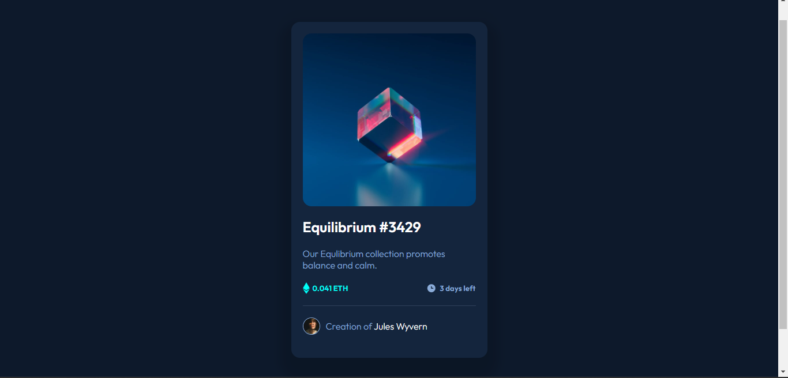

# Frontend Mentor - NFT preview card component solution by Maame

This is a solution to the [NFT preview card component challenge on Frontend Mentor](https://www.frontendmentor.io/challenges/nft-preview-card-component-SbdUL_w0U). Frontend Mentor challenges help you improve your coding skills by building realistic projects. 

## Table of contents

- [Overview](#overview)
  - [The challenge](#the-challenge)
  - [Screenshot](#screenshot)
  - [Links](#links)
- [My process](#my-process)
  - [Built with](#built-with)
  - [What I learned](#what-i-learned)
  - [Continued development](#continued-development)
  - [Useful resources](#useful-resources)
- [Author](#author)

## Overview

### The challenge

Users should be able to:

- View the optimal layout depending on their device's screen size
- See hover states for interactive elements

### Screenshot

Normal state

Active state

### Links

- Solution URL: [Nft Preview Card](https://github.com/mbonamensa/fem_nft-preview-card)
- Live Site URL: [Frontend Mentor | Nft Preview Card by Maame](https://mbonamensa.github.io/fem_nft-preview-card)
- Figma Design: [I created a figma file](https://www.figma.com/file/pAYt5zPsd4aqHiBzM3TucY/Frontend-Mentor--NFT-Preview-Card?node-id=0%3A1)

## My process

### Built with

- Semantic HTML5 markup
- SASS
- Flexbox

### What I learned

I learned how to create box shadows in figma, since I created my own figam file from the design images given. I had to do a little research to figure out how to do that. It made coding the actual box shadow easier because figma generated the code.

I also practiced creating image overlays on hover with `flex` and `opacity`

I found out also that the little space under images within a div is because the browser adds some whitespace to adjust for other inline-level elements because `img`. Adding a `display: block;` fixes this issue.

### Continued development

I'll keep learning how to use Figma to create designs.

### Useful resources

- [Apply Shadow or blur effects](https://help.figma.com/hc/en-us/articles/360041488473-Apply-shadow-or-blur-effects) - This helped me figure a way to add box shadows to the design.
- [How to remove the extra white space underneath an image using CSS ](https://www.tutorialrepublic.com/faq/how-to-remove-white-space-under-an-image-using-css.php) - I finally understood why images always had spaces underneath them when inside a div.

## Author

- Website - [Maame Yaa Serwaa Bona-Mensa](https://mbonamensa.netlify.app)
- Frontend Mentor - [@mbonamensa](https://www.frontendmentor.io/profile/mbonamensa)
- Twitter - [@Mys_BM](https://www.twitter.com/mys_bm)
